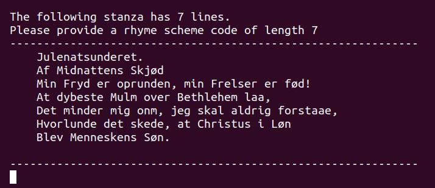
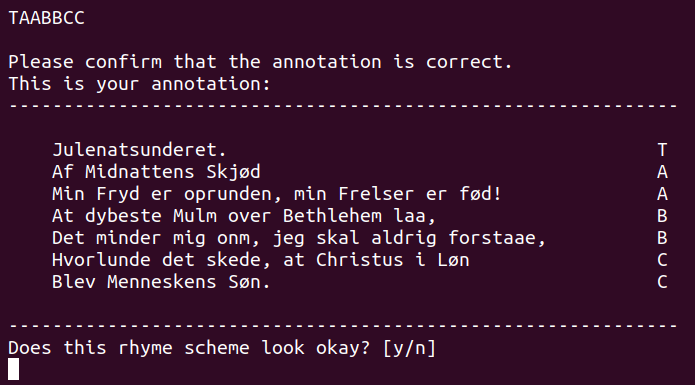

# Annotation Guidelines

For each stanza, the annotator should provide a rhyme scheme code; a string of characters of the same length as the number of lines in the stanza.
The characters in the rhyme scheme code should correspond to the rhyme scheme of the stanza. 
Iff the first and second line of the stanza rhyme, the first and second letter of the rhyme scheme code should be the same letter.

For the stanza  
```
2. Oplad vor Mund, din Lov udbred,
til Andagt Hjertet vel bered,
forøg vor Tro, styrk vor Forstand,
at vi dit Navn ret kjende kan!
```
A correct rhyme scheme code is "AABB" (or "QQWW"). Examples of incorrect rhyme scheme code are "ABAB", "AAAA" or "AABBA". 

## Acceptable characters for rhyme scheme code
You may use any of the characters QWERYUOPASDFGHJKLZXCVBM to annotate the rhyme scheme of a stanza.  

## Special characters
There are three special characters that are used to annotate lines that for some reason can not be annotated for rhyme scheme normally.

### T - Title
Used when the line is the title of the poem. 
If the data is formatted correctly, this should be used exclusively on the first line of the first stanza of the poem. Not all poems contain a title.

Example:

For the stanza  
```
Cleander til Clarice.
Clarice, mindes du den gang
Da jeg i Marken laae,
Og lystig om min Frihed sang,
For jeg din Skjønhed saae:
```
a correct rhyme scheme code is **T**ABAB.


### N - Noise 
Used when:
* the line is not in Norwegian or most words are noisy/unintelligeble
* the line-ending-word contains noise/is not a proper word

Example: 
For the stanza 
```
Over stod Solen stilleøt
og spredte trindt sin Pragt,
det hele stille Billed
i gyldne Baand var lagt.
```
a correct rhyme scheme code is "**N**ABA", because the line-ending word on the first line contains noise.

For the stanza
```
Der brast vel mangen Pande,
Der rödmed Iljemmets Jord
1 Ftævnet mod vor Grande,
h)en gjæve svenske Broer.
```
a correct rhyme scheme code is "A**NNN**", because lines 2-4 contain too much noise for us to want to include it in our dataset, 
even if the line-ending-words are free from noise.

### I - Info
Used when:
* the line is not a part of the poem itself, but contains information about the poem

Example:  
For the stanza  
```
4. Tak ske Gud Fader, Søn og Aand,
Et i Fuldkommenhedens Baand,
den hellige Treenighed
ske Lov og Pris i Evighed!
Wilhelm 11, Hertug af Sachsen-Weimar, ; 1662.
```
a correct rhyme scheme code is "AABB**I**".

## The definition of rhyme
Sometimes there the stanzas contain word pairs that don't fully rhyme, but almost, and the rhyme scheme of previous stanzas indicate that the author meant for these to rhyme. In these cases, annotate them as rhymes. The author is a published poet and we should accept their definition of rhyme. 

Example:
For the stanza
```
Hvor skulde da jeg mindes fro
Enhver, som var mig huld og tro
i Venskab og i Sangen
og skued jeg mod Norges Fjeld,
af Mindets Vemod i min Sjæl
steg liflig Efterklangen!
```
A correct rhyme scheme code is "AABCCB", because Fjeld (modern Norwegian: Fjell) and Sjæl (modern Norwegian: Sjel) _almost_ rhyme. 
Note that the words should be very close to a perfect rhyme. Some poems change rhyme patterns from stanza to stanza, so use some discretion and don't annotate something as rhyme if you don't think it rhymes at all.

# Notes on the annotation script
The annotation script is a simple tool to help you annotate rhyme scheme. 
It will read poems from a folder, and present them to you, stanza by stanza.
  
You will be asked to provide a rhyme scheme code for the given stanza, and once you have provided a rhyme scheme code of the correct length, you will see the poem annotated line for line with your rhyme scheme code.   
  
You will be asked to confirm that this is correct, and if so your annotation is saved and you will get the next stanza.

