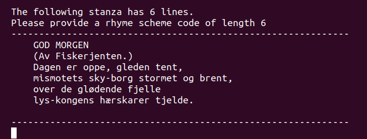
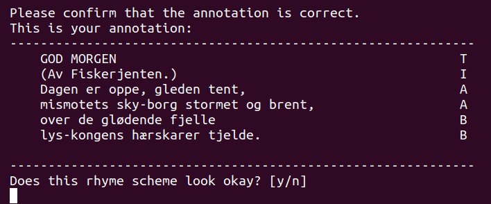

# How to help annotate:
1. Read the [guidelines](annotation_guidelines.md)
2. Run the annotation script like this: `python3 annotate.py <your-name> -s poems_subset`
3. Have fun annotating 75-ish stanzas :D Thank you!

# Notes on the annotation script:
The annotation script is a simple tool to help you annotate rhyme scheme. 
It will read poems from a folder, and present them to you, stanza by stanza (aka split it on double newlines and feed each bit one by one). 
For each stanza, you will be asked to provide a rhyme scheme code (see the [annotation guidelines](annotation_guidelines.md) for more on this), and your annotations will be saved after each.

## Dependencies
The annotation script was created with Python 3.8.10, but should work for all versions >= 3.4 without installing any packages.

## Running the annotation script
Run the script like this:
```
python3 annotate-py <destination_dir> -s <source_dir>
```
Where `destination_dir` is the directory where your annotations are saved and `source_dir` is where the poems to annotate are stored. In this case, `poems_subset` is used to measure inter-annotator agreement, and `poems` is the _not yet_ full data set of poetry to be annotated.


# Intro to the annotation script
The annotation script is a simple tool to help you annotate rhyme scheme. 
It will read poems from a folder, and present them to you, stanza by stanza.  
  
You will be asked to provide a rhyme scheme code for the given stanza, and once you have provided a rhyme scheme code of the correct length, you will see the poem annotated line for line with your rhyme scheme code.  
  
You will be asked to confirm that this is correct, and if so your annotation is saved and you will be presented with the next stanza.

