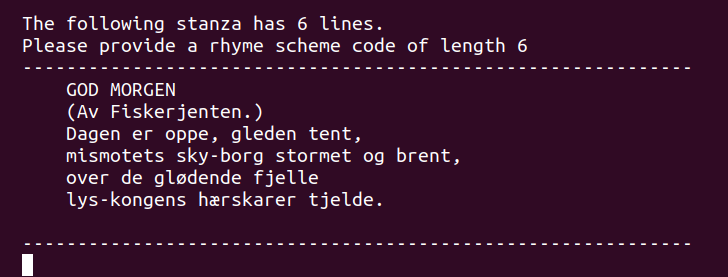

# Annotation Guidelines

For each stanza, the annotator should provide a rhyme scheme code; a string of characters of the same length as the number of lines in the stanza.
The characters in the rhyme scheme code should correspond to the rhyme scheme of the stanza. 
Iff the first and second line of the stanza rhyme, the first and second letter of the rhyme scheme code should be the same letter.

For the stanza  
```
Den natten bygget vi et drømmeslott
med hvite saler, blanke marmorflater 
det skulle ligge høyt og sees godt
i sol og luft med åpne, lyse gater
```
A correct rhyme scheme code is "ABAB" (or "QQWW"). Examples of incorrect rhyme scheme code are "ABBA", "AAAA" or "AABBA". 

## Acceptable characters for rhyme scheme code
You may use any of the characters QWERYUOPASDFGHJKLZXCVBM to annotate the rhyme scheme of a stanza.  

## Special characters
There are three special characters that are used to annotate lines that for some reason can not be annotated for rhyme scheme normally.

### T - Title
Used when 
* the line is the title of the poem.  

If the data is formatted correctly, this should usually be on the first line of the first stanza of the poem. Not all poems contain a title.

Example:

For the stanza  
```
RIDDERSLAG
Vi har en verden å vinne
og ikke en time å miste.
Så skulle vi famle i blinde
og spikre oss selv en kiste?
```
a correct rhyme scheme code is **T**ABAB.

### I - Info
Used when:
* the line is not a part of the poem itself, but contains information about the poem

Example:  
For the stanza  
```
ENGELSKE SOCIALISTER
Etter generalstreiken.
Nå vask deres hender! Ta på dere jakken,
Mac Donald og Thomas og Henderson!
Nå ligger han rolig med kniven i nakken,
den tosk! La ham bare bli liggende sånn.
```
a correct rhyme scheme code is "T**I**ABAB".

### N - Noise 
Used when:
* the line is not in Norwegian or most words are noisy/unintelligeble
* the line-ending-word contains noise/is not a proper word

Example: 
For the stanza 
```
fo ⁶) pndehe s ro ⁷ft fjerner,
⁸⁸ er mantdøde fiksidders rov,
og trærne ser man ei for bare skog,
man knuser nøttene med skall og kjerner.
En patriot forteller at han verner
om landets kraft når bare han er grov,
og vraker åndens nektar med en lov
av tankefinkel fra de tomme hjerner.
```
a correct rhyme scheme code is "**NN**ABBCCB", because lines 1 and 2 contain too much noise for us to want to include it in our dataset, 
even if the line-ending-words are free from noise.


## The definition of rhyme
Sometimes there the stanzas contain word pairs that don't fully rhyme, but almost. Because the data is fairly old, you might observe examples where the words would rhyme if you replace the t-sound with the d-sound or other ways to speak that are similar to old *riksmål*. Try to annotate the rhyme as accurately as possible given how the stanza is written. 

Example:
For the stanza
```
Verden, hvor er du full av gåter,                                
kverner som hav i klippering,                                    
maler din must til lette fråder,                                 
knuser din kraft til ingenting!
```
a correct rhyme scheme code is "ABCB". It might be tempting to annotate "gåter" and "fråder" as rhyming, and this was probably what the author meant as well (when this was written almost 100 years ago). But, unless you speak a dialect where these words actually rhyme, please do not annotate word pairs as rhyming if they don't rhyme the way you would pronounce it. 

Example:
For the stanza
```
Her ser du i blest bak det vimrende løv
i sortmalte linjer: Guds fred med ditt støv!
hvor sorgen sitt minnekvad satte.
Om enkelt og kluntet, mitt hjerte hvor rikt,
når livet fortolker de skjønneste dikt
som hjertene bare kan fatte
```
a correct rhyme scheme code is "AABCCB". Though "rikt" and "dikt" have different stress, with the "i" being long in "rikt" and short in "dikt", the words are similar enough that this should be accepted as rhyme. 


# Intro to the annotation script
The annotation script is a simple tool to help you annotate rhyme scheme. 
It will read poems from a folder, and present them to you, stanza by stanza.  
  
You will be asked to provide a rhyme scheme code for the given stanza, and once you have provided a rhyme scheme code of the correct length, you will see the poem annotated line for line with your rhyme scheme code.  
  
You will be asked to confirm that this is correct, and if so your annotation is saved and you will be presented with the next stanza.

